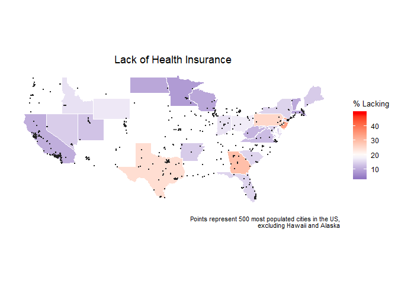

Final\_Report
================

Team Members and UNIs:
----------------------

Melanie Mayer; mm4963
Jaisal Amin; ja3314
Rebekah Yu; dry2115
Courtney Johnson; cj2493

Motivation, Background, and Initial Questions:
----------------------------------------------

Motivation for this project was rooted in the group's collective interest in the impact of public health initiatives on health outcomes. While exploring for related datasets, we found city-level data on health practices and health outcomes from the CDC. Project objectives and analysis plans were mainly driven by the data and the information available from the data set.

The initial question we explored was what are the associations between: (1) prevalence of lack of health insurance, (2) regular health practices (i.e. pap smear, doctor visits, mammograms), and (3) health outcomes (diabetes, kidney disease, smoking).

To further support our analysis, we hypothesized that health expenditures could be a possible predictor of outcomes and practices, thus, an external data set of health expenditures by state was included. In addition, we were interested in regional trends of health for the data. To obtain regional categories, we found an external data set including four regions and states included in each region.

Data:
-----

Our data was taken from the 500 cities project. The data used for their analysis was obtained from the Centers of Disease Control, Division of Population Health, Epidemiology, and Surveillance Branch. The dataset provides model-based estimates for the prevalence of various diseases/practices in order to help local public health officials better serve their communities. We filtered out many variables and ultimately chose to only keep diseases associated with higher rates of fatality and/or those that placed a higher burden on our healthcare system. We also kept variables that could be clearly classified as "health practices" or behaviors whose primary purpose is to maintain or improve one's health. Because we were interested in the relationship between these variables and health insurance/expenditure, we kept the variable associated with prevalence of lack of insurance and imported data on healthcare expenditure by state from the Henry J. Kaiser Family Foundation. In order to conduct regional analysis, we imported a dataset that classified states based on region.

Link to original data set from the CDC: <https://chronicdata.cdc.gov/500-Cities/500-Cities-City-level-Data-GIS-Friendly-Format-201/k56w-7tny/data>

When attempting to extract the data using the API, some variables (such as city name and state) were dropped in the process. Our data was obtained and completed in 2016, so we found it appropriate to simply download the CSV to use for our analysis. Below is the link to the data set that was read in for our project: <https://drive.google.com/file/d/1ltT_y_W5kveipbEq6smnpsjmVADIwnee/view?usp=sharing>

Data for health care expenditure was downloaded from the Henry J. Kaiser Family Foundation Link to our health care expenditure data: <https://drive.google.com/file/d/1jlps3e265Q9eZoBXcgKTu5YrKwOOHTFc/view?usp=sharing>

Data for state and region categories were found on Chris Halpert's github. Link to region and state data: <https://drive.google.com/file/d/1jlps3e265Q9eZoBXcgKTu5YrKwOOHTFc/view?usp=sharing>

### Instructions for reading in data:

Download the data sets from the google drive links given above. In the code below, replace the "read\_csv" locations to the local locations where data is downloaded.

Code for reading in, merging, and cleaning data:

``` r
cdc_df = read_csv("./data/500_Cities__City-level_Data__GIS_Friendly_Format___2016_release.csv")
```

    ## Parsed with column specification:
    ## cols(
    ##   .default = col_character(),
    ##   Population2010 = col_integer(),
    ##   ACCESS2_CrudePrev = col_double(),
    ##   ACCESS2_AdjPrev = col_double(),
    ##   ARTHRITIS_CrudePrev = col_double(),
    ##   ARTHRITIS_AdjPrev = col_double(),
    ##   BINGE_CrudePrev = col_double(),
    ##   BINGE_AdjPrev = col_double(),
    ##   BPHIGH_CrudePrev = col_double(),
    ##   BPHIGH_AdjPrev = col_double(),
    ##   BPMED_CrudePrev = col_double(),
    ##   BPMED_AdjPrev = col_double(),
    ##   CANCER_CrudePrev = col_double(),
    ##   CANCER_AdjPrev = col_double(),
    ##   CASTHMA_CrudePrev = col_double(),
    ##   CASTHMA_AdjPrev = col_double(),
    ##   CHD_CrudePrev = col_double(),
    ##   CHD_AdjPrev = col_double(),
    ##   CHECKUP_CrudePrev = col_double(),
    ##   CHECKUP_AdjPrev = col_double(),
    ##   CHOLSCREEN_CrudePrev = col_double()
    ##   # ... with 37 more columns
    ## )

    ## See spec(...) for full column specifications.

``` r
#Select variables of interest
cdc_df = cdc_df %>%
  select(c(StateAbbr, PlaceName, Population2010, ACCESS2_AdjPrev, BPHIGH_AdjPrev, BPMED_AdjPrev, CANCER_AdjPrev, CHD_AdjPrev, CHECKUP_AdjPrev, CHOLSCREEN_AdjPrev, COLON_SCREEN_AdjPrev, COPD_AdjPrev,COREM_AdjPrev, COREW_AdjPrev, DENTAL_AdjPrev, DIABETES_AdjPrev, HIGHCHOL_AdjPrev, LPA_AdjPrev, MAMMOUSE_AdjPrev, OBESITY_AdjPrev, PAPTEST_AdjPrev, PHLTH_AdjPrev, STROKE_AdjPrev, Geolocation)) %>% 
  mutate(state = abbr2state(StateAbbr)) %>%
  select(state, everything())
#Importing the raw expenditure data set and cleaning
healthcare_exp_df = read_csv("./data/health_care_expenditure.csv", 
                             skip = 4, n_max = 51, col_names = F) %>%
  rename(state = "X1", health_exp = "X2") %>%
  mutate(health_exp = str_replace(health_exp, "\\$", ""),
         health_exp  = as.numeric(health_exp))
```

    ## Parsed with column specification:
    ## cols(
    ##   X1 = col_character(),
    ##   X2 = col_character()
    ## )

``` r
#Add state healthcare expenditure data to CDC data
cdc_df = left_join(cdc_df, healthcare_exp_df, by = "state")
cdc_df = cdc_df %>% mutate(state = abbr2state(StateAbbr))
#Merge data regions per state
regions_df = read_csv("https://raw.githubusercontent.com/cphalpert/census-regions/master/us%20census%20bureau%20regions%20and%20divisions.csv") %>%
  janitor::clean_names() %>%
  select(-state_code)
```

    ## Parsed with column specification:
    ## cols(
    ##   State = col_character(),
    ##   `State Code` = col_character(),
    ##   Region = col_character(),
    ##   Division = col_character()
    ## )

``` r
cdc_df = left_join(cdc_df, regions_df, by = "state")
```

Similar to downloading our initial data, variable obtaining issues progressed when attempting to scrape the data for our data dictionary. Therefore, we copied the data dictionary given on the website and pasted into an excel file. Below is the link to the excel data dictionary file:

<https://drive.google.com/file/d/1Myn3kicEjmmeD2PGoOehSlA30UtFfaV9/view?usp=sharing>

Code to create a data dictionary:

``` r
data_dictionary = readxl::read_xlsx("./data/data_dictionary.xlsx") 
data_dictionary = data_dictionary %>%
  janitor::clean_names() %>%
  filter(column_name %in% c("StateAbbr", "PlaceName", "Population2010", "ACCESS2_AdjPrev", "BPHIGH_AdjPrev", "BPMED_AdjPrev", "CANCER_AdjPrev", "CHD_AdjPrev", "CHECKUP_AdjPrev", "CHOLSCREEN_AdjPrev", "COLON_SCREEN_AdjPrev", "COPD_AdjPrev", "COREM_AdjPrev", "COREW_AdjPrev", "DENTAL_AdjPrev", "DIABETES_AdjPrev", "HIGHCHOL_AdjPrev", "LPA_AdjPrev", "MAMMOUSE_AdjPrev", "OBESITY_AdjPrev", "PAPTEST_AdjPrev", "PHLTH_AdjPrev", "STROKE_AdjPrev", "Geolocation"))
health_exp_dictionary = tibble(column_name = c("state", "health_exp"),
                               description = c("full name of the state", "total healthcare expenditures per capita by state in 2014"),
                               type = c("Plain Text", "Number"))
data_dictionary = full_join(data_dictionary, health_exp_dictionary)
```

    ## Joining, by = c("column_name", "description", "type")

``` r
region_dict = tibble(column_name = c("region", "division"),
                     description = c("geographical region of the state", "more specific division within the region"),
                     type = c("Plain Text", "Plain Text")
)
data_dictionary = full_join(data_dictionary, region_dict)
```

    ## Joining, by = c("column_name", "description", "type")

Exploratory Analysis:
---------------------

Shiny plots were created to explore the associations between health factors and health outcomes. We defined two health factors of interest: (1) prevalence of uninsured people by city and (2) health care expenditure by state. To give visualizations of the type of plots created, the code below illustrates the plots for the health outcome, cancer. However, in the Shiny document, users can toggle between 9 outcomes.

``` r
# transform data to long form
outcome_transform = cdc_df %>% 
  mutate(city_state = str_c(PlaceName, StateAbbr, sep = ", ")) %>%
  gather(key = outcome, value = prevalence, BPHIGH_AdjPrev, CANCER_AdjPrev, CHD_AdjPrev, COPD_AdjPrev,    DIABETES_AdjPrev, HIGHCHOL_AdjPrev, OBESITY_AdjPrev, PHLTH_AdjPrev, STROKE_AdjPrev) %>% 
  mutate(outcome = str_replace(outcome, "_AdjPrev", ""), 
        outcome = recode(outcome, 'BPHIGH' = 'High Blood Pressure',
                                  'CANCER' = 'Cancer',
                                  'CHD' = 'Coronary Heart Disease',
                                  'COPD' = 'Chronic Obstructive Pulmonary Disease',
                                  'DIABETES' = 'Diabetes',
                                  'HIGHCHOL' = 'High Cholesterol',
                                  'OBESITY' = 'Obesity',
                                  'PHLTH' = 'Poor Physical Health',
                                  'STROKE' = 'Stroke')) %>%
  select(city_state, ACCESS2_AdjPrev, Population2010, Geolocation, health_exp, region, division, outcome, prevalence) 
# Plot of Prevalence of Cancer vs. Prevalence of Uninsured
outcome_transform %>%
  filter(outcome == "Cancer") %>%
  ggplot(aes(x = ACCESS2_AdjPrev, y = prevalence, color = region)) +
    geom_point(alpha = 0.5) +
    labs(
      x = "Prevalence of Uninsured in City",
      y = "Prevalence of Cancer")
```


``` r
#Plot of Prevalence of Cancer vs. Health Care Expenditures
outcome_transform %>%
  filter(outcome == "Cancer") %>%
  ggplot(aes(x = health_exp, y = prevalence, color = region)) +
    geom_point(alpha = 0.5) +
    labs(
      x = "Health Expenditure",
      y = "Prevalence of Health Outcome (millions)")
```


From the plots above, we see that as the percentage of uninsured people increase, the prevalence of cancer decreases. This trend could be explained by the fact that the more people who are uninsured, the less screening for cancer is done, and thus there is a smaller prevalence of diagnosed cancer recorded. There is not an obvious trend for health care expenditures and cancer prevalence. We use the Shiny app to look at the associations with different health outcomes.

Additional Analysis:
--------------------

### Regression Analysis:

To explore the relationship between commonly used health practices and health outcomes, we tried to fit some multiple linear regression models using backwards selection. The models we created were attempting to predict the prevalence of cancer, high cholesterol and diabetes. For each model, we started with all of the health practice variables: core screenings for men, core screenings for women, dental visits, lack of physical activity, mammogram usage, routine checkups, cholesterol screenings, and colon screenings. All of these variables are also in terms of prevalence. Then, to show the results in a way that people who aren't statisticians could understand, I produced a table for each model that showed which variables were included in the final model and the direction of effect they had on the disease prevalence.

``` r
health_practice = c("Core Practices for Men", "Dental Visits", "Mammogram Usage",
                    "Routine Checkups", "Colon Screening")
effect = c("Positive", "Negative", "Negative", "Negative", "Positive")
estimate = c(0.012, -0.033, -0.036, -0.0095, 0.107)
p_val = c(0.012, '1.06e-14', '2.31e-06', 0.0295, '< 2e-16')
cancer_tbl = tibble(
  "Health Practice" = health_practice,
  "Effect on Cancer Prevalence" = effect,
  "Coefficient Estimate" = estimate,
  "P-Value" = p_val
)
cancer_tbl %>%
  knitr::kable() %>%
  kable_styling(bootstrap_options = "striped", full_width = T, position = "center")
```

<table class="table table-striped" style="margin-left: auto; margin-right: auto;">
<thead>
<tr>
<th style="text-align:left;">
Health Practice
</th>
<th style="text-align:left;">
Effect on Cancer Prevalence
</th>
<th style="text-align:right;">
Coefficient Estimate
</th>
<th style="text-align:left;">
P-Value
</th>
</tr>
</thead>
<tbody>
<tr>
<td style="text-align:left;">
Core Practices for Men
</td>
<td style="text-align:left;">
Positive
</td>
<td style="text-align:right;">
0.0120
</td>
<td style="text-align:left;">
0.012
</td>
</tr>
<tr>
<td style="text-align:left;">
Dental Visits
</td>
<td style="text-align:left;">
Negative
</td>
<td style="text-align:right;">
-0.0330
</td>
<td style="text-align:left;">
1.06e-14
</td>
</tr>
<tr>
<td style="text-align:left;">
Mammogram Usage
</td>
<td style="text-align:left;">
Negative
</td>
<td style="text-align:right;">
-0.0360
</td>
<td style="text-align:left;">
2.31e-06
</td>
</tr>
<tr>
<td style="text-align:left;">
Routine Checkups
</td>
<td style="text-align:left;">
Negative
</td>
<td style="text-align:right;">
-0.0095
</td>
<td style="text-align:left;">
0.0295
</td>
</tr>
<tr>
<td style="text-align:left;">
Colon Screening
</td>
<td style="text-align:left;">
Positive
</td>
<td style="text-align:right;">
0.1070
</td>
<td style="text-align:left;">
&lt; 2e-16
</td>
</tr>
</tbody>
</table>
``` r
health_practice = c("Dental Visits", "Lack of Physical Activity",
                    "Routine Checkups", "Colon Screening")
effect = c("Negative", "Positive", "Positive", "Positive")
estimate = c(-0.064, 0.171, 0.0401, 0.061)
p_val = c(0.004, '9.18e-07', 0.049, 0.037)
chol_tbl = tibble(
  "Health Practice" = health_practice,
  "Effect on High Cholesterol Prevalence" = effect,
  "Coefficient Estimate" = estimate,
  "P-Value" = p_val
)
chol_tbl %>%
  knitr::kable() %>%
  kable_styling(bootstrap_options = "striped", full_width = T, position = "center")
```

<table class="table table-striped" style="margin-left: auto; margin-right: auto;">
<thead>
<tr>
<th style="text-align:left;">
Health Practice
</th>
<th style="text-align:left;">
Effect on High Cholesterol Prevalence
</th>
<th style="text-align:right;">
Coefficient Estimate
</th>
<th style="text-align:left;">
P-Value
</th>
</tr>
</thead>
<tbody>
<tr>
<td style="text-align:left;">
Dental Visits
</td>
<td style="text-align:left;">
Negative
</td>
<td style="text-align:right;">
-0.0640
</td>
<td style="text-align:left;">
0.004
</td>
</tr>
<tr>
<td style="text-align:left;">
Lack of Physical Activity
</td>
<td style="text-align:left;">
Positive
</td>
<td style="text-align:right;">
0.1710
</td>
<td style="text-align:left;">
9.18e-07
</td>
</tr>
<tr>
<td style="text-align:left;">
Routine Checkups
</td>
<td style="text-align:left;">
Positive
</td>
<td style="text-align:right;">
0.0401
</td>
<td style="text-align:left;">
0.049
</td>
</tr>
<tr>
<td style="text-align:left;">
Colon Screening
</td>
<td style="text-align:left;">
Positive
</td>
<td style="text-align:right;">
0.0610
</td>
<td style="text-align:left;">
0.037
</td>
</tr>
</tbody>
</table>
``` r
health_practice = c("Core Practices for Women", "Dental Visits", "Lack of Physical Activity", "Mammogram Usage", "Routine Checkups", "Cholesterol Screening")
effect = c("Negative", "Negative", "Positive", "Positive", "Positive", "Negative")
estimate = c(-0.063, -0.135, 0.193, 0.085, 0.076, -0.074)
p_val = c('6.19e-11', '< 2e-16', '< 2e-16', '1.44e-08', '1.33e-08', 0.0004)
diab_tbl = tibble(
  "Health Practice" = health_practice,
  "Effect on Diabetes Prevalence" = effect,
  "Coefficient Estimate" = estimate,
  "P-Value" = p_val
)
diab_tbl %>%
  knitr::kable() %>%
  kable_styling(bootstrap_options = "striped", full_width = T, position = "center")
```

<table class="table table-striped" style="margin-left: auto; margin-right: auto;">
<thead>
<tr>
<th style="text-align:left;">
Health Practice
</th>
<th style="text-align:left;">
Effect on Diabetes Prevalence
</th>
<th style="text-align:right;">
Coefficient Estimate
</th>
<th style="text-align:left;">
P-Value
</th>
</tr>
</thead>
<tbody>
<tr>
<td style="text-align:left;">
Core Practices for Women
</td>
<td style="text-align:left;">
Negative
</td>
<td style="text-align:right;">
-0.063
</td>
<td style="text-align:left;">
6.19e-11
</td>
</tr>
<tr>
<td style="text-align:left;">
Dental Visits
</td>
<td style="text-align:left;">
Negative
</td>
<td style="text-align:right;">
-0.135
</td>
<td style="text-align:left;">
&lt; 2e-16
</td>
</tr>
<tr>
<td style="text-align:left;">
Lack of Physical Activity
</td>
<td style="text-align:left;">
Positive
</td>
<td style="text-align:right;">
0.193
</td>
<td style="text-align:left;">
&lt; 2e-16
</td>
</tr>
<tr>
<td style="text-align:left;">
Mammogram Usage
</td>
<td style="text-align:left;">
Positive
</td>
<td style="text-align:right;">
0.085
</td>
<td style="text-align:left;">
1.44e-08
</td>
</tr>
<tr>
<td style="text-align:left;">
Routine Checkups
</td>
<td style="text-align:left;">
Positive
</td>
<td style="text-align:right;">
0.076
</td>
<td style="text-align:left;">
1.33e-08
</td>
</tr>
<tr>
<td style="text-align:left;">
Cholesterol Screening
</td>
<td style="text-align:left;">
Negative
</td>
<td style="text-align:right;">
-0.074
</td>
<td style="text-align:left;">
4e-04
</td>
</tr>
</tbody>
</table>
We ran simple linear regressions to determine if there was an association between the prevalence of lack of insurance and the prevalence of health outcomes -- colon/cancer/cholestrol screenings, mammograms, etc. The purpose here was not to build a predictive model, only to test association and therefore any statistics related to model reliability were disregarded.

``` r
cdc_df %>%
  lm(ACCESS2_AdjPrev ~ CHECKUP_AdjPrev, data = .) %>%
  summary
```

    ## 
    ## Call:
    ## lm(formula = ACCESS2_AdjPrev ~ CHECKUP_AdjPrev, data = .)
    ## 
    ## Residuals:
    ##      Min       1Q   Median       3Q      Max 
    ## -14.3033  -4.8734  -0.8666   3.9749  30.8858 
    ## 
    ## Coefficients:
    ##                 Estimate Std. Error t value Pr(>|t|)    
    ## (Intercept)     16.67317    4.15554   4.012 6.94e-05 ***
    ## CHECKUP_AdjPrev  0.02259    0.06097   0.370    0.711    
    ## ---
    ## Signif. codes:  0 '***' 0.001 '**' 0.01 '*' 0.05 '.' 0.1 ' ' 1
    ## 
    ## Residual standard error: 6.857 on 498 degrees of freedom
    ## Multiple R-squared:  0.0002755,  Adjusted R-squared:  -0.001732 
    ## F-statistic: 0.1372 on 1 and 498 DF,  p-value: 0.7112

``` r
cdc_df %>%
  lm(ACCESS2_AdjPrev ~ DENTAL_AdjPrev, data = .) %>%
  summary
```

    ## 
    ## Call:
    ## lm(formula = ACCESS2_AdjPrev ~ DENTAL_AdjPrev, data = .)
    ## 
    ## Residuals:
    ##      Min       1Q   Median       3Q      Max 
    ## -11.5583  -2.1019  -0.1286   1.7714  19.7386 
    ## 
    ## Coefficients:
    ##                Estimate Std. Error t value Pr(>|t|)    
    ## (Intercept)    64.75462    1.44079   44.94   <2e-16 ***
    ## DENTAL_AdjPrev -0.75038    0.02306  -32.54   <2e-16 ***
    ## ---
    ## Signif. codes:  0 '***' 0.001 '**' 0.01 '*' 0.05 '.' 0.1 ' ' 1
    ## 
    ## Residual standard error: 3.879 on 498 degrees of freedom
    ## Multiple R-squared:  0.6802, Adjusted R-squared:  0.6795 
    ## F-statistic:  1059 on 1 and 498 DF,  p-value: < 2.2e-16

``` r
cdc_df %>%
  lm(ACCESS2_AdjPrev ~ CHOLSCREEN_AdjPrev, data = .) %>%
  summary
```

    ## 
    ## Call:
    ## lm(formula = ACCESS2_AdjPrev ~ CHOLSCREEN_AdjPrev, data = .)
    ## 
    ## Residuals:
    ##      Min       1Q   Median       3Q      Max 
    ## -11.4146  -4.7829  -0.7015   3.9088  20.8205 
    ## 
    ## Coefficients:
    ##                    Estimate Std. Error t value Pr(>|t|)    
    ## (Intercept)        99.27618    6.38321   15.55   <2e-16 ***
    ## CHOLSCREEN_AdjPrev -1.09796    0.08638  -12.71   <2e-16 ***
    ## ---
    ## Signif. codes:  0 '***' 0.001 '**' 0.01 '*' 0.05 '.' 0.1 ' ' 1
    ## 
    ## Residual standard error: 5.959 on 498 degrees of freedom
    ## Multiple R-squared:  0.245,  Adjusted R-squared:  0.2435 
    ## F-statistic: 161.6 on 1 and 498 DF,  p-value: < 2.2e-16

``` r
cdc_df %>%
  lm(ACCESS2_AdjPrev ~ COLON_SCREEN_AdjPrev, data = .) %>%
  summary
```

    ## 
    ## Call:
    ## lm(formula = ACCESS2_AdjPrev ~ COLON_SCREEN_AdjPrev, data = .)
    ## 
    ## Residuals:
    ##    Min     1Q Median     3Q    Max 
    ## -9.662 -2.687 -0.535  2.568 13.338 
    ## 
    ## Coefficients:
    ##                      Estimate Std. Error t value Pr(>|t|)    
    ## (Intercept)          81.64527    2.00151   40.79   <2e-16 ***
    ## COLON_SCREEN_AdjPrev -1.01284    0.03183  -31.82   <2e-16 ***
    ## ---
    ## Signif. codes:  0 '***' 0.001 '**' 0.01 '*' 0.05 '.' 0.1 ' ' 1
    ## 
    ## Residual standard error: 3.938 on 498 degrees of freedom
    ## Multiple R-squared:  0.6703, Adjusted R-squared:  0.6696 
    ## F-statistic:  1012 on 1 and 498 DF,  p-value: < 2.2e-16

``` r
cdc_df %>%
  lm(ACCESS2_AdjPrev ~ COREM_AdjPrev, data = .) %>%
  summary
```

    ## 
    ## Call:
    ## lm(formula = ACCESS2_AdjPrev ~ COREM_AdjPrev, data = .)
    ## 
    ## Residuals:
    ##      Min       1Q   Median       3Q      Max 
    ## -12.0230  -4.1028  -0.1845   3.6097  28.4732 
    ## 
    ## Coefficients:
    ##               Estimate Std. Error t value Pr(>|t|)    
    ## (Intercept)   39.03085    1.67760   23.27   <2e-16 ***
    ## COREM_AdjPrev -0.65385    0.05201  -12.57   <2e-16 ***
    ## ---
    ## Signif. codes:  0 '***' 0.001 '**' 0.01 '*' 0.05 '.' 0.1 ' ' 1
    ## 
    ## Residual standard error: 5.975 on 498 degrees of freedom
    ## Multiple R-squared:  0.2409, Adjusted R-squared:  0.2394 
    ## F-statistic: 158.1 on 1 and 498 DF,  p-value: < 2.2e-16

``` r
cdc_df %>%
  lm(ACCESS2_AdjPrev ~ COREW_AdjPrev, data = .) %>%
  summary
```

    ## 
    ## Call:
    ## lm(formula = ACCESS2_AdjPrev ~ COREW_AdjPrev, data = .)
    ## 
    ## Residuals:
    ##      Min       1Q   Median       3Q      Max 
    ## -12.8653  -3.7809  -0.4643   3.1987  26.5916 
    ## 
    ## Coefficients:
    ##               Estimate Std. Error t value Pr(>|t|)    
    ## (Intercept)   42.61860    1.47487   28.90   <2e-16 ***
    ## COREW_AdjPrev -0.79882    0.04759  -16.78   <2e-16 ***
    ## ---
    ## Signif. codes:  0 '***' 0.001 '**' 0.01 '*' 0.05 '.' 0.1 ' ' 1
    ## 
    ## Residual standard error: 5.481 on 498 degrees of freedom
    ## Multiple R-squared:  0.3613, Adjusted R-squared:   0.36 
    ## F-statistic: 281.7 on 1 and 498 DF,  p-value: < 2.2e-16

``` r
cdc_df %>%
  lm(ACCESS2_AdjPrev ~ LPA_AdjPrev, data = .) %>%
  summary
```

    ## 
    ## Call:
    ## lm(formula = ACCESS2_AdjPrev ~ LPA_AdjPrev, data = .)
    ## 
    ## Residuals:
    ##      Min       1Q   Median       3Q      Max 
    ## -11.0931  -2.8884  -0.1922   2.8727  19.6451 
    ## 
    ## Coefficients:
    ##             Estimate Std. Error t value Pr(>|t|)    
    ## (Intercept) -4.99785    0.87664  -5.701 2.04e-08 ***
    ## LPA_AdjPrev  0.96496    0.03554  27.150  < 2e-16 ***
    ## ---
    ## Signif. codes:  0 '***' 0.001 '**' 0.01 '*' 0.05 '.' 0.1 ' ' 1
    ## 
    ## Residual standard error: 4.355 on 498 degrees of freedom
    ## Multiple R-squared:  0.5968, Adjusted R-squared:  0.596 
    ## F-statistic: 737.1 on 1 and 498 DF,  p-value: < 2.2e-16

``` r
cdc_df %>%
  lm(ACCESS2_AdjPrev ~ MAMMOUSE_AdjPrev, data = .) %>%
  summary
```

    ## 
    ## Call:
    ## lm(formula = ACCESS2_AdjPrev ~ MAMMOUSE_AdjPrev, data = .)
    ## 
    ## Residuals:
    ##      Min       1Q   Median       3Q      Max 
    ## -12.4533  -4.5578  -0.8023   3.7676  22.5717 
    ## 
    ## Coefficients:
    ##                  Estimate Std. Error t value Pr(>|t|)    
    ## (Intercept)      80.29846    5.35431   15.00   <2e-16 ***
    ## MAMMOUSE_AdjPrev -0.79808    0.06873  -11.61   <2e-16 ***
    ## ---
    ## Signif. codes:  0 '***' 0.001 '**' 0.01 '*' 0.05 '.' 0.1 ' ' 1
    ## 
    ## Residual standard error: 6.084 on 498 degrees of freedom
    ## Multiple R-squared:  0.213,  Adjusted R-squared:  0.2115 
    ## F-statistic: 134.8 on 1 and 498 DF,  p-value: < 2.2e-16

``` r
cdc_df %>%
  lm(ACCESS2_AdjPrev ~ PAPTEST_AdjPrev, data = .) %>%
  summary
```

    ## 
    ## Call:
    ## lm(formula = ACCESS2_AdjPrev ~ PAPTEST_AdjPrev, data = .)
    ## 
    ## Residuals:
    ##      Min       1Q   Median       3Q      Max 
    ## -13.9574  -3.6682  -0.2634   2.9858  18.5909 
    ## 
    ## Coefficients:
    ##                  Estimate Std. Error t value Pr(>|t|)    
    ## (Intercept)     120.21507    5.41489   22.20   <2e-16 ***
    ## PAPTEST_AdjPrev  -1.26490    0.06708  -18.86   <2e-16 ***
    ## ---
    ## Signif. codes:  0 '***' 0.001 '**' 0.01 '*' 0.05 '.' 0.1 ' ' 1
    ## 
    ## Residual standard error: 5.238 on 498 degrees of freedom
    ## Multiple R-squared:  0.4165, Adjusted R-squared:  0.4154 
    ## F-statistic: 355.5 on 1 and 498 DF,  p-value: < 2.2e-16

``` r
cdc_df %>%
  lm(ACCESS2_AdjPrev ~ PHLTH_AdjPrev, data = .) %>%
  summary
```

    ## 
    ## Call:
    ## lm(formula = ACCESS2_AdjPrev ~ PHLTH_AdjPrev, data = .)
    ## 
    ## Residuals:
    ##     Min      1Q  Median      3Q     Max 
    ## -15.636  -2.915  -0.440   2.083  22.033 
    ## 
    ## Coefficients:
    ##               Estimate Std. Error t value Pr(>|t|)    
    ## (Intercept)   -4.90960    0.99643  -4.927 1.14e-06 ***
    ## PHLTH_AdjPrev  1.84260    0.07763  23.734  < 2e-16 ***
    ## ---
    ## Signif. codes:  0 '***' 0.001 '**' 0.01 '*' 0.05 '.' 0.1 ' ' 1
    ## 
    ## Residual standard error: 4.698 on 498 degrees of freedom
    ## Multiple R-squared:  0.5308, Adjusted R-squared:  0.5298 
    ## F-statistic: 563.3 on 1 and 498 DF,  p-value: < 2.2e-16

``` r
health_practice = c("Health Checkup", "Cholestrol Screening", "Colon Screening", "Dental", "COREM", "COREW", "LPA", "Mammogram", "Pap Test", "Poor Physical Health")
linear = c("No", "Yes", "Yes", "Yes", "Yes", "Yes", "Yes", "Yes", "Yes", "Yes")
direction = c("NA", "Negative", "Negative", "Negative", "Negative", "Negative", "Positive", "Negative", "Negative", "Positive")
p_value = c(0.711, '<2e-16', '<2e-16', '<2e-16', '<2e-16', '<2e-16', '<2e-16', '<2e-16', '<2e-16', '<2e-16')
insurance_asso = tibble(
  "Health Practice" = health_practice,
  "Linear Association?" = linear,
  "Direction of Association" = direction,
  "p-value" = p_value
) 
insurance_asso %>% 
  knitr::kable() %>% 
  kable_styling(bootstrap_options = "striped", full_width = T, position = "center")
```

<table class="table table-striped" style="margin-left: auto; margin-right: auto;">
<thead>
<tr>
<th style="text-align:left;">
Health Practice
</th>
<th style="text-align:left;">
Linear Association?
</th>
<th style="text-align:left;">
Direction of Association
</th>
<th style="text-align:left;">
p-value
</th>
</tr>
</thead>
<tbody>
<tr>
<td style="text-align:left;">
Health Checkup
</td>
<td style="text-align:left;">
No
</td>
<td style="text-align:left;">
NA
</td>
<td style="text-align:left;">
0.711
</td>
</tr>
<tr>
<td style="text-align:left;">
Cholestrol Screening
</td>
<td style="text-align:left;">
Yes
</td>
<td style="text-align:left;">
Negative
</td>
<td style="text-align:left;">
&lt;2e-16
</td>
</tr>
<tr>
<td style="text-align:left;">
Colon Screening
</td>
<td style="text-align:left;">
Yes
</td>
<td style="text-align:left;">
Negative
</td>
<td style="text-align:left;">
&lt;2e-16
</td>
</tr>
<tr>
<td style="text-align:left;">
Dental
</td>
<td style="text-align:left;">
Yes
</td>
<td style="text-align:left;">
Negative
</td>
<td style="text-align:left;">
&lt;2e-16
</td>
</tr>
<tr>
<td style="text-align:left;">
COREM
</td>
<td style="text-align:left;">
Yes
</td>
<td style="text-align:left;">
Negative
</td>
<td style="text-align:left;">
&lt;2e-16
</td>
</tr>
<tr>
<td style="text-align:left;">
COREW
</td>
<td style="text-align:left;">
Yes
</td>
<td style="text-align:left;">
Negative
</td>
<td style="text-align:left;">
&lt;2e-16
</td>
</tr>
<tr>
<td style="text-align:left;">
LPA
</td>
<td style="text-align:left;">
Yes
</td>
<td style="text-align:left;">
Positive
</td>
<td style="text-align:left;">
&lt;2e-16
</td>
</tr>
<tr>
<td style="text-align:left;">
Mammogram
</td>
<td style="text-align:left;">
Yes
</td>
<td style="text-align:left;">
Negative
</td>
<td style="text-align:left;">
&lt;2e-16
</td>
</tr>
<tr>
<td style="text-align:left;">
Pap Test
</td>
<td style="text-align:left;">
Yes
</td>
<td style="text-align:left;">
Negative
</td>
<td style="text-align:left;">
&lt;2e-16
</td>
</tr>
<tr>
<td style="text-align:left;">
Poor Physical Health
</td>
<td style="text-align:left;">
Yes
</td>
<td style="text-align:left;">
Positive
</td>
<td style="text-align:left;">
&lt;2e-16
</td>
</tr>
</tbody>
</table>
``` r
dental = cdc_df %>% 
  ggplot(aes(x = ACCESS2_AdjPrev, y = DENTAL_AdjPrev)) + 
  geom_point(alpha = 0.5) + 
  theme_bw() +
  xlab("% Without Insurance") +
  ylab("Dental")
colon = cdc_df %>% 
  ggplot(aes(x = ACCESS2_AdjPrev, y = COLON_SCREEN_AdjPrev)) + 
  geom_point(alpha = 0.5) + 
  theme_bw() +
  xlab("% Without Insurance") +
  ylab("Colon Screening")
lpa = cdc_df %>% 
  ggplot(aes(x = ACCESS2_AdjPrev, y = LPA_AdjPrev)) + 
  geom_point(alpha = 0.5) + 
  theme_bw() +
  xlab("% Without Insurance") +
  ylab("No Physical Activity")
phlth = cdc_df %>% 
  ggplot(aes(x = ACCESS2_AdjPrev, y = PHLTH_AdjPrev)) + 
  geom_point(alpha = 0.5) + 
  theme_bw() +
  xlab("% Without Insurance") +
  ylab("Poor Physical Health")
(dental | colon) / (lpa | phlth)
```


We also wanted to look at lack of health insurance prevalence and health expenditure by state and compare across regions. We created graphs to display differences and ran an ANOVA to test significance.

``` r
usa = map_data("state") %>%
  rename(state = "region")
cdc_df_map = read_csv("./data/cdc_df.csv") %>%
  separate(Geolocation, into = c("long", "lat"), sep = ",") %>%
  mutate(long = str_replace(long, "\\(", ""),
         lat = str_replace(lat, "\\)", ""),
         long = as.numeric(long),
         lat = as.numeric(lat),
         state = factor(state),
         state = tolower(state)) %>%
  filter(!state %in% c("alaska", "hawaii")) %>%
  left_join(., usa, by = "state")
```

    ## Parsed with column specification:
    ## cols(
    ##   .default = col_double(),
    ##   state = col_character(),
    ##   StateAbbr = col_character(),
    ##   PlaceName = col_character(),
    ##   Population2010 = col_integer(),
    ##   Geolocation = col_character(),
    ##   health_exp = col_integer(),
    ##   region = col_character(),
    ##   division = col_character()
    ## )

    ## See spec(...) for full column specifications.

``` r
ggplot() + 
  geom_polygon(data = cdc_df_map, aes(x = long.y, y = lat.y, group = state, 
                                      fill = ACCESS2_AdjPrev), 
               color = "white") +
  scale_fill_gradient2(low = "dark blue", mid = "white", high = "red", space = "Lab",
                       midpoint = mean(cdc_df_map$ACCESS2_AdjPrev),
                       name = "% Lacking") +
  coord_fixed(1) +
  geom_point(data = cdc_df_map, aes(x = lat.x, y = long.x), 
             color = "grey13", size = 0.5, alpha = 0.3) +
  theme_bw() +
  theme(axis.title.x = element_blank(),
        axis.text.x = element_blank(),
        axis.ticks.x = element_blank(),
        axis.title.y = element_blank(),
        axis.text.y = element_blank(),
        axis.ticks.y = element_blank(),
        legend.title = element_text(size = 10),
        plot.caption = element_text(size = 8),
        panel.grid.major = element_blank(), 
        panel.grid.minor = element_blank(),
        panel.border = element_blank()) +
  labs(title = "Lack of Health Insurance",
       caption = 
         "Points represent 500 most populated cities in the US,\n excluding Hawaii and Alaska") +
  theme(plot.title = element_text(hjust = 0.5))
```



``` r
usa = map_data("state") %>%
  rename(state = "region")
cdc_df_map = read_csv("./data/cdc_df.csv") %>%
  separate(Geolocation, into = c("long", "lat"), sep = ",") %>%
  mutate(long = str_replace(long, "\\(", ""),
         lat = str_replace(lat, "\\)", ""),
         long = as.numeric(long),
         lat = as.numeric(lat),
         state = factor(state),
         state = tolower(state)) %>%
  filter(!state %in% c("alaska", "hawaii")) %>%
  left_join(., usa, by = "state")
```

    ## Parsed with column specification:
    ## cols(
    ##   .default = col_double(),
    ##   state = col_character(),
    ##   StateAbbr = col_character(),
    ##   PlaceName = col_character(),
    ##   Population2010 = col_integer(),
    ##   Geolocation = col_character(),
    ##   health_exp = col_integer(),
    ##   region = col_character(),
    ##   division = col_character()
    ## )

    ## See spec(...) for full column specifications.

``` r
ggplot() + 
  geom_polygon(data = cdc_df_map, aes(x = long.y, y = lat.y, 
                                      group = state, fill = health_exp), color = "white") +
  scale_fill_gradient2(low = "red", mid = "white", high = "blue", space = "Lab",
                       midpoint = mean(cdc_df_map$health_exp),
                       name = "US Dollars") +
  coord_fixed(1) +
  geom_point(data = cdc_df_map, aes(x = lat.x, y = long.x), 
             color = "grey13", size = 0.5, alpha = 0.3) +
  theme_bw() +
  theme(axis.title.x = element_blank(),
        axis.text.x = element_blank(),
        axis.ticks.x = element_blank(),
        axis.title.y = element_blank(),
        axis.text.y = element_blank(),
        axis.ticks.y = element_blank(),
        legend.title = element_text(size = 10),
        plot.caption = element_text(size = 8),
        panel.grid.major = element_blank(), 
        panel.grid.minor = element_blank(),
        panel.border = element_blank()) +
  labs(title = "Healthcare Expenditure per Capita",
       caption = 
         "Points represent 500 most populated cities in the US,\n excluding Hawaii and Alaska") + 
  theme(plot.title = element_text(hjust = 0.5))
```


``` r
cdc_df %>%
  distinct(state, .keep_all = TRUE) %>%
  mutate(text_label = str_c("Health Expenditures per Capita: ", health_exp, '\nState: ', StateAbbr)) %>%
  mutate(region = fct_reorder(region, health_exp)) %>%
  plot_ly(y = ~health_exp, color = ~region, type = "box", text = ~text_label) %>%
  layout(
    xaxis = list(title = "Region"),
    yaxis = list(title = "Health Expenditures per Capita per State"),
    title = "Comparing Healthcare Expenditure Across Regions",
    font = "Open Sans",
    titlefont = "Open Sans"
  )
```

<!--html_preserve-->

<script type="application/json" data-for="htmlwidget-743d394857afd566090b">{"x":{"visdat":{"4c5025e12b12":["function () ","plotlyVisDat"]},"cur_data":"4c5025e12b12","attrs":{"4c5025e12b12":{"y":{},"text":{},"color":{},"alpha_stroke":1,"sizes":[10,100],"spans":[1,20],"type":"box"}},"layout":{"margin":{"b":40,"l":60,"t":25,"r":10},"xaxis":{"domain":[0,1],"automargin":true,"title":"Region"},"yaxis":{"domain":[0,1],"automargin":true,"title":"Health Expenditures per Capita per State"},"title":"Comparing Healthcare Expenditure Across Regions","font":"Open Sans","titlefont":"Open Sans","hovermode":"closest","showlegend":true},"source":"A","config":{"modeBarButtonsToAdd":[{"name":"Collaborate","icon":{"width":1000,"ascent":500,"descent":-50,"path":"M487 375c7-10 9-23 5-36l-79-259c-3-12-11-23-22-31-11-8-22-12-35-12l-263 0c-15 0-29 5-43 15-13 10-23 23-28 37-5 13-5 25-1 37 0 0 0 3 1 7 1 5 1 8 1 11 0 2 0 4-1 6 0 3-1 5-1 6 1 2 2 4 3 6 1 2 2 4 4 6 2 3 4 5 5 7 5 7 9 16 13 26 4 10 7 19 9 26 0 2 0 5 0 9-1 4-1 6 0 8 0 2 2 5 4 8 3 3 5 5 5 7 4 6 8 15 12 26 4 11 7 19 7 26 1 1 0 4 0 9-1 4-1 7 0 8 1 2 3 5 6 8 4 4 6 6 6 7 4 5 8 13 13 24 4 11 7 20 7 28 1 1 0 4 0 7-1 3-1 6-1 7 0 2 1 4 3 6 1 1 3 4 5 6 2 3 3 5 5 6 1 2 3 5 4 9 2 3 3 7 5 10 1 3 2 6 4 10 2 4 4 7 6 9 2 3 4 5 7 7 3 2 7 3 11 3 3 0 8 0 13-1l0-1c7 2 12 2 14 2l218 0c14 0 25-5 32-16 8-10 10-23 6-37l-79-259c-7-22-13-37-20-43-7-7-19-10-37-10l-248 0c-5 0-9-2-11-5-2-3-2-7 0-12 4-13 18-20 41-20l264 0c5 0 10 2 16 5 5 3 8 6 10 11l85 282c2 5 2 10 2 17 7-3 13-7 17-13z m-304 0c-1-3-1-5 0-7 1-1 3-2 6-2l174 0c2 0 4 1 7 2 2 2 4 4 5 7l6 18c0 3 0 5-1 7-1 1-3 2-6 2l-173 0c-3 0-5-1-8-2-2-2-4-4-4-7z m-24-73c-1-3-1-5 0-7 2-2 3-2 6-2l174 0c2 0 5 0 7 2 3 2 4 4 5 7l6 18c1 2 0 5-1 6-1 2-3 3-5 3l-174 0c-3 0-5-1-7-3-3-1-4-4-5-6z"},"click":"function(gd) { \n        // is this being viewed in RStudio?\n        if (location.search == '?viewer_pane=1') {\n          alert('To learn about plotly for collaboration, visit:\\n https://cpsievert.github.io/plotly_book/plot-ly-for-collaboration.html');\n        } else {\n          window.open('https://cpsievert.github.io/plotly_book/plot-ly-for-collaboration.html', '_blank');\n        }\n      }"}],"cloud":false},"data":[{"y":[11064,6452,7549,6804,7299,6927,8221,6714,7214,8044,5982,7913,8320],"text":["Health Expenditures per Capita: 11064<br />State: AK","Health Expenditures per Capita: 6452<br />State: AZ","Health Expenditures per Capita: 7549<br />State: CA","Health Expenditures per Capita: 6804<br />State: CO","Health Expenditures per Capita: 7299<br />State: HI","Health Expenditures per Capita: 6927<br />State: ID","Health Expenditures per Capita: 8221<br />State: MT","Health Expenditures per Capita: 6714<br />State: NV","Health Expenditures per Capita: 7214<br />State: NM","Health Expenditures per Capita: 8044<br />State: OR","Health Expenditures per Capita: 5982<br />State: UT","Health Expenditures per Capita: 7913<br />State: WA","Health Expenditures per Capita: 8320<br />State: WY"],"type":"box","name":"West","marker":{"color":"rgba(102,194,165,1)","line":{"color":"rgba(102,194,165,1)"}},"line":{"color":"rgba(102,194,165,1)"},"xaxis":"x","yaxis":"y","frame":null},{"y":[7281,7408,10254,11944,8076,6587,8004,7815,8602,7646,7264,7627,7311,7372,6998,7556,9462],"text":["Health Expenditures per Capita: 7281<br />State: AL","Health Expenditures per Capita: 7408<br />State: AR","Health Expenditures per Capita: 10254<br />State: DE","Health Expenditures per Capita: 11944<br />State: DC","Health Expenditures per Capita: 8076<br />State: FL","Health Expenditures per Capita: 6587<br />State: GA","Health Expenditures per Capita: 8004<br />State: KY","Health Expenditures per Capita: 7815<br />State: LA","Health Expenditures per Capita: 8602<br />State: MD","Health Expenditures per Capita: 7646<br />State: MS","Health Expenditures per Capita: 7264<br />State: NC","Health Expenditures per Capita: 7627<br />State: OK","Health Expenditures per Capita: 7311<br />State: SC","Health Expenditures per Capita: 7372<br />State: TN","Health Expenditures per Capita: 6998<br />State: TX","Health Expenditures per Capita: 7556<br />State: VA","Health Expenditures per Capita: 9462<br />State: WV"],"type":"box","name":"South","marker":{"color":"rgba(252,141,98,1)","line":{"color":"rgba(252,141,98,1)"}},"line":{"color":"rgba(252,141,98,1)"},"xaxis":"x","yaxis":"y","frame":null},{"y":[8262,8300,8200,7651,8055,8871,8107,8412,9851,8712,8933,8702],"text":["Health Expenditures per Capita: 8262<br />State: IL","Health Expenditures per Capita: 8300<br />State: IN","Health Expenditures per Capita: 8200<br />State: IA","Health Expenditures per Capita: 7651<br />State: KS","Health Expenditures per Capita: 8055<br />State: MI","Health Expenditures per Capita: 8871<br />State: MN","Health Expenditures per Capita: 8107<br />State: MO","Health Expenditures per Capita: 8412<br />State: NE","Health Expenditures per Capita: 9851<br />State: ND","Health Expenditures per Capita: 8712<br />State: OH","Health Expenditures per Capita: 8933<br />State: SD","Health Expenditures per Capita: 8702<br />State: WI"],"type":"box","name":"Midwest","marker":{"color":"rgba(141,160,203,1)","line":{"color":"rgba(141,160,203,1)"}},"line":{"color":"rgba(141,160,203,1)"},"xaxis":"x","yaxis":"y","frame":null},{"y":[9859,9531,10559,9589,8859,9778,9258,9551,10190],"text":["Health Expenditures per Capita: 9859<br />State: CT","Health Expenditures per Capita: 9531<br />State: ME","Health Expenditures per Capita: 10559<br />State: MA","Health Expenditures per Capita: 9589<br />State: NH","Health Expenditures per Capita: 8859<br />State: NJ","Health Expenditures per Capita: 9778<br />State: NY","Health Expenditures per Capita: 9258<br />State: PA","Health Expenditures per Capita: 9551<br />State: RI","Health Expenditures per Capita: 10190<br />State: VT"],"type":"box","name":"Northeast","marker":{"color":"rgba(231,138,195,1)","line":{"color":"rgba(231,138,195,1)"}},"line":{"color":"rgba(231,138,195,1)"},"xaxis":"x","yaxis":"y","frame":null}],"highlight":{"on":"plotly_click","persistent":false,"dynamic":false,"selectize":false,"opacityDim":0.2,"selected":{"opacity":1},"debounce":0},"base_url":"https://plot.ly"},"evals":["config.modeBarButtonsToAdd.0.click"],"jsHooks":[]}</script>
<!--/html_preserve-->
<table>
<thead>
<tr>
<th style="text-align:left;">
term
</th>
<th style="text-align:right;">
df
</th>
<th style="text-align:right;">
sumsq
</th>
<th style="text-align:right;">
meansq
</th>
<th style="text-align:right;">
statistic
</th>
<th style="text-align:right;">
p.value
</th>
</tr>
</thead>
<tbody>
<tr>
<td style="text-align:left;">
region
</td>
<td style="text-align:right;">
3
</td>
<td style="text-align:right;">
25422970
</td>
<td style="text-align:right;">
8474323
</td>
<td style="text-align:right;">
7.43803
</td>
<td style="text-align:right;">
0.0003559
</td>
</tr>
<tr>
<td style="text-align:left;">
Residuals
</td>
<td style="text-align:right;">
47
</td>
<td style="text-align:right;">
53548214
</td>
<td style="text-align:right;">
1139324
</td>
<td style="text-align:right;">
NA
</td>
<td style="text-align:right;">
NA
</td>
</tr>
</tbody>
</table>
<table class="table table-striped" style="width: auto !important; margin-left: auto; margin-right: auto;">
<thead>
<tr>
<th style="text-align:left;">
Term
</th>
<th style="text-align:left;">
Test
</th>
<th style="text-align:right;">
Test Statistic
</th>
<th style="text-align:right;">
P-Value
</th>
</tr>
</thead>
<tbody>
<tr>
<td style="text-align:left;">
Region
</td>
<td style="text-align:left;">
ANOVA
</td>
<td style="text-align:right;">
7.43803
</td>
<td style="text-align:right;">
0.0003559
</td>
</tr>
</tbody>
</table>
Discussion:
-----------

Starting with health insurance, we found that there is a negative correlation between lack of health insurance and prevalence of proactive health practices, which include screening for diseases, and a positive correlation between variables pertaining to poor physical health. The notable exception was the routine checkups variable. There was no association between percent uninsured and the prevalence of routine checkups. This could indicate that there is a cost factor to these associations. Having established an association between insurance and preventative care, we next analyzed the predictive ability of health practices on health outcomes. We found that the health practice variables from the dataset have the most predictive power for prevalence of cancer, and the least for high cholesterol. Intuitively, this makes sense for a couple of reasons. First, cholesterol levels are highly related to genetics, and this dataset has no variables collected on genetics. Also, many of the practices measured by this dataset are cancer screening practices. Cancer screening and other proactive health practices that we have mentioned tend to be very expensive, particularly for the uninsured. Since we know cost is often prohibitive, we next wanted to see if healthcare expenditure is uniform across the United States. Regional health expenditure analysis showed that there is a significant difference in healthcare expenditure between regions.
Lastly, we inspected the relationships between specific diseases and health expenditure and percent uninsured. For most diseases, percent uninsured was found to have a positive association with disease. However, this trend is reversed with cancer. But, the relationship between health expenditures and prevalence of disease did not vary with disease.
Overall, we found that the relationships between health insurance coverage, disease, and health practices is incredibly intricate and we've only scratched the surface of these questions of interest.
